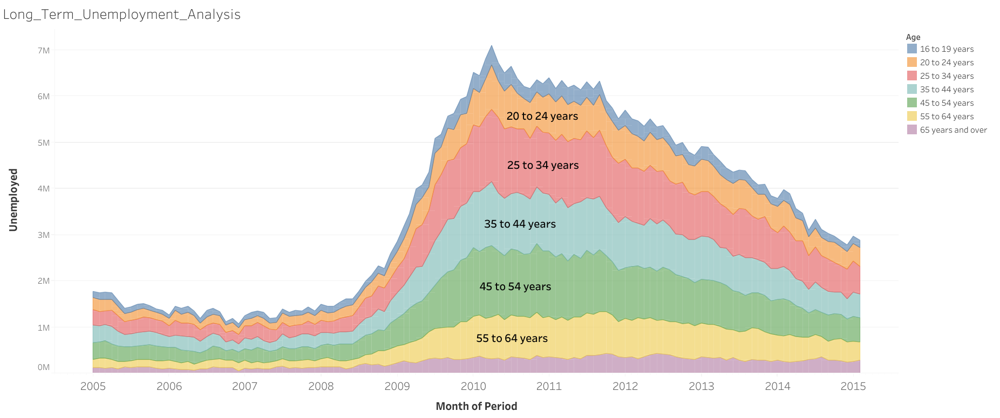
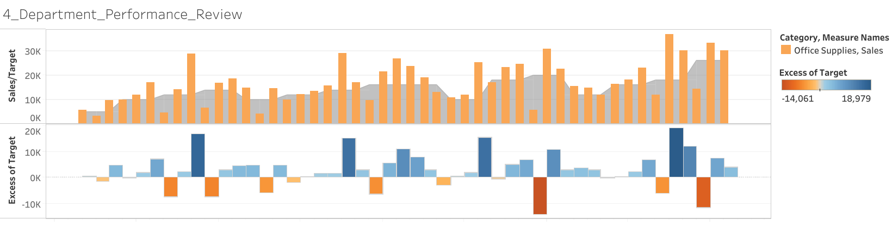
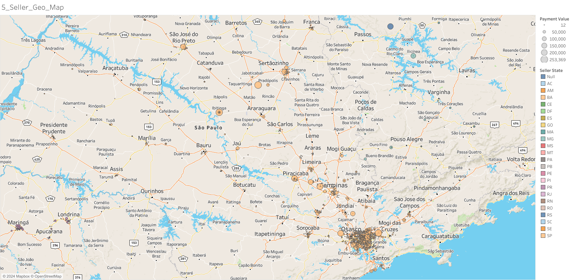
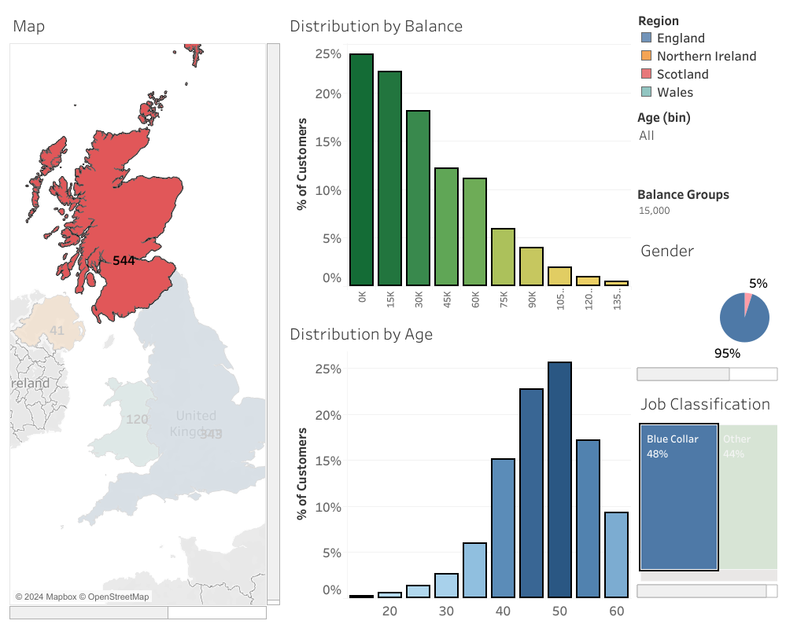
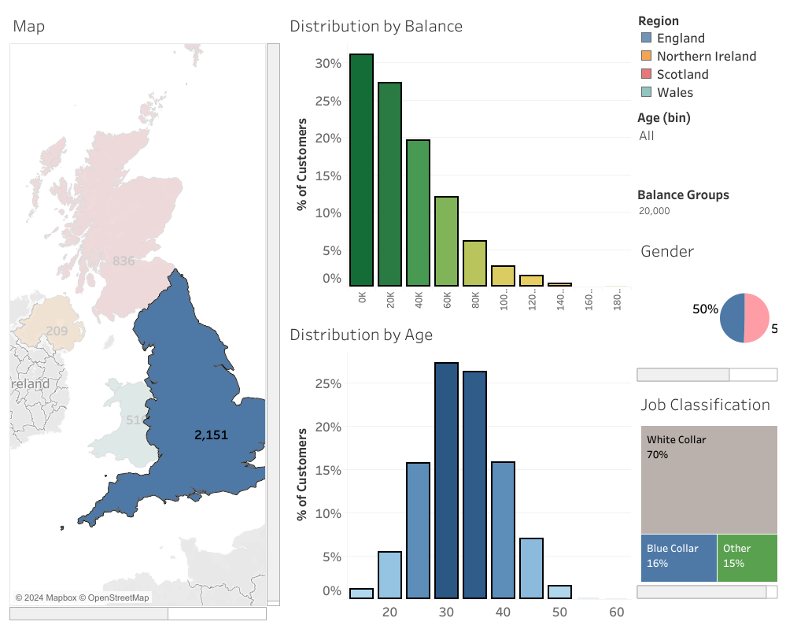
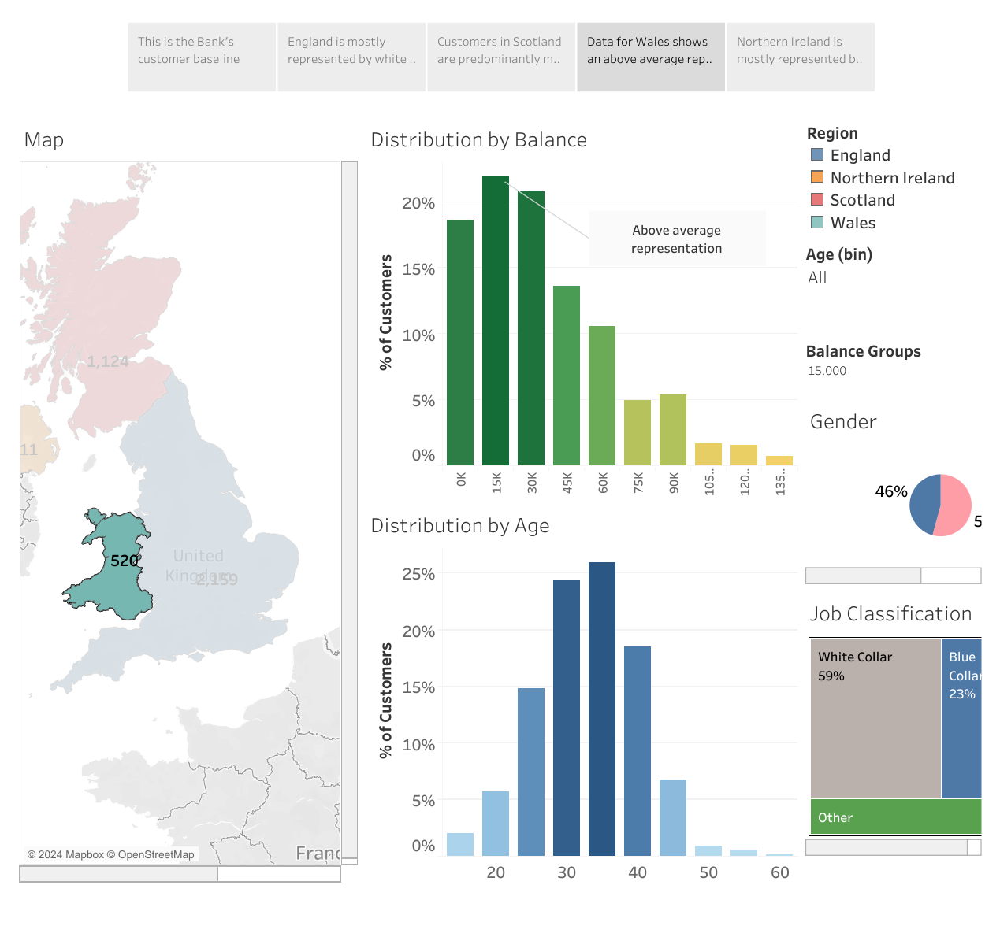
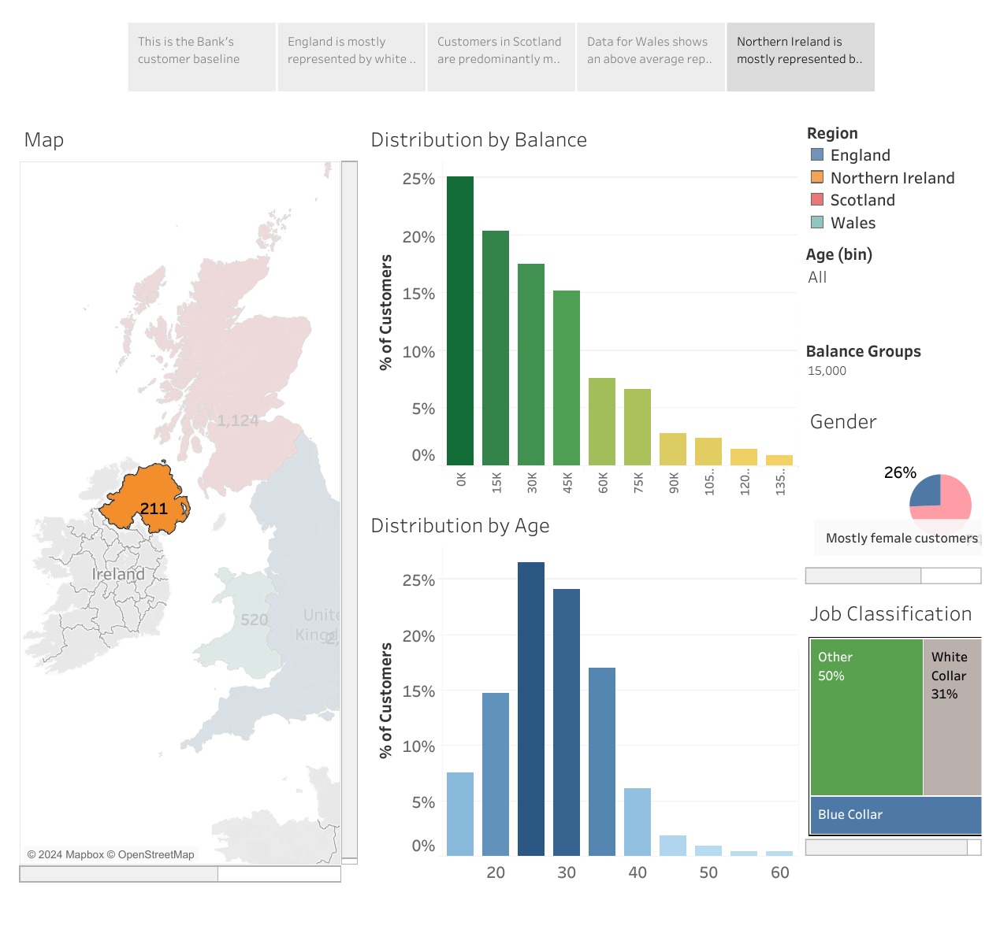
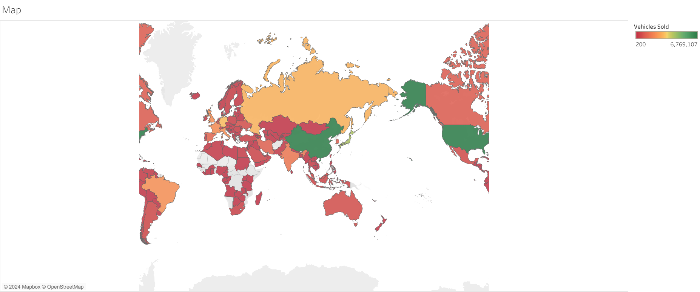
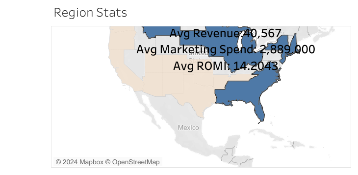
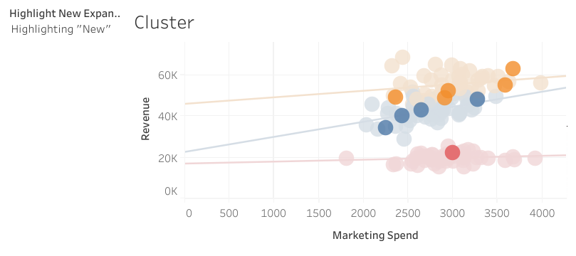

# Table of Contents
- [Table of Contents](#table-of-contents)
- [Introduction](#introduction)
- [Tools I Used](#tools-i-used)
- [The Vizzes](#the-vizzes)
    - [1. Basic Bar Charts](#1-basic-bar-charts)
    - [2. Time series, Aggregation, and Filters](#2-time-series-aggregation-and-filters)
    - [3. Dashboards](#3-dashboards)
    - [4. Joining and Blending Tables](#4-joining-and-blending-tables)
    - [5. Relationships](#5-relationships)
    - [6. Storytelling from Dashboards](#6-storytelling-from-dashboards)
    - [7. Data Cleaning and Preparation](#7-data-cleaning-and-preparation)
    - [8. Clusters, Custom Territories, Desgin Features](#8-clusters-custom-territories-desgin-features)
- [What I Learned](#what-i-learned)
- [Conclusion](#conclusion)
    - [Closing Thoughts](#closing-thoughts)
    - [What's Next](#whats-next)

# Introduction
:mega: This Tableau portfolio documents my learning journey through Kirill Eremenko's [course on Udemy](https://www.udemy.com/course/tableau10).

:computer: Check out my Tableau profile here: [Tableau Profile](https://public.tableau.com/app/profile/mei.liu4813/vizzes)

# Tools I Used
- **Tableau Desktop and Public:** A powerful data visualization and business intelligence tool owned by Salesforce. In this project, I connected Tableau to various datasets, analyzed and transformed data, and visualized it through various charts, plots, and maps. All visualizations are published on Tableau Public.
- **Microsoft Excel:** The source data is in spreadsheets, so I used Excel for initial data examination, an essential step in ETL.
- **Git and Github:** My go-to for version control and tracking my project progress.

# The Vizzes

### 1. Basic Bar Charts

Datasource: [Data_Office_Supplies](Datasources/OfficeSupplies.csv)

This bar chart shows which sales representatives generated the highest sales, categorized by region.

*Bar chart with total sales by sales representatives categorized by region* 

### 2. Time series, Aggregation, and Filters

Datasource: [Data_Long_term_unemployment_statistics](Datasources/Long-Term-Unemployment-Statistics.xlsx)

My Viz: [Long_term_unemployment_statistics](https://public.tableau.com/app/profile/mei.liu4813/viz/Long_Term_Unemployment_Analysis_17319042561240/Long_Term_Unemployment_Analysis)

*Area chart aggregating number of umployment filtered by age groups*

### 3. Dashboards
Datasource: [Data_AmazingMartEU2](Datasources/AmazingMartEU2.xlsx)

My Viz: [Customer_Margin_Dashboard](https://public.tableau.com/app/profile/mei.liu4813/viz/Customer_Margin_Dashboard/CustomerMarginDashboard)

Here are my findings:
- This dashboard features a map of Europe alongside scatterplots that visualize customer margins, segmented by performance. Margins below 50% are displayed in red to indicate underperformance, while margins above 50% appear in blue, representing satisfactory performance.
- A Year filter is available and applies to all worksheets across the workbook, allowing users to focus on specific time periods. Additionally, an action filter enables users to interact with the dashboard, dynamically updating the customer scatter plot based on their selections
  

*Dashboard filtered by country with customer margin scatter plots*

### 4. Joining and Blending Tables

Datasource: [Data_AmazingMartEU2](Datasources/AmazingMartEU2.xlsx)

My Viz: [Department_Performance_Review](https://public.tableau.com/app/profile/mei.liu4813/viz/4_Department_Performance_Review/4_Department_Performance_Review)

Here are my findings:
- The furniture department follows a linear target, while the office supplies department has a quarterly target. In contrast, the technology department reviews and sets its target annually for the following year.

- The furniture department has consistently underperformed, suggesting their target may need to be reassessed. The technology department shows clusters of underperformance, indicating that a quarterly or monthly target may be more appropriate. The office supplies department has the fewest underperforming months, suggesting that a quarterly target is well-suited for this department.

*Dual axis chart to visualize monthly department performances*

### 5. Relationships

Datasource: [Data_Brazilian_E-Commerce_Public_Dataset_by_Olist](/https://www.kaggle.com/datasets/olistbr/brazilian-ecommerce)

My Viz: [Seller_geo_map](https://public.tableau.com/app/profile/mei.liu4813/viz/5_Seller_Geo_Map/5_Seller_Geo_Map)

Here is the task: Create a street map to illustrate seller geographic information.

*Street map showing sellers' geo location*

### 6. Storytelling from Dashboards 

Datasource: [Data_UK_Bank_Customers](Datasources/UK_Bank_Customers.csv)

My Viz: [Customer_demographic_dashboard](https://public.tableau.com/app/profile/mei.liu4813/viz/6_Customer_Demographic_Dashboard/Customer_Demographic_Dahsboard)

Here are some insights derived from this dashboard:

- The majority of customers in Scotland are male, blue-collar workers aged 40-50, while in England, customers are predominantly white-collar workers aged 30-40, with an equal gender distribution. This difference may be influenced by London’s status as an economic hub of Europe. Customers from Wales aging between 30 - 40 has above average mid-sized balances. Lastly, in Northern Ireland, customers are dominantly females in young age groups. Consequently, marketing strategies should be tailored for each region according to this analysis.

- This dashboard helps the bank better understand its customer base, enabling it to offer more relevant, customized products based on customer demographics.

*Interative dashboard illustrating customer demographic in Scotland*

*Interative dashboard illustrating customer demographic in England*

*Interative dashboard illustrating customer demographic in Wales*

*Interative dashboard illustrating customer demographic in Northern Ireland*

### 7. Data Cleaning and Preparation

Datasource: [Data_Personal_Vehicle_Sales_Global](Datasources/PersonalVehicleSalesGlobal.xlsx)

My Viz: [Vehicle_sales_map](https://public.tableau.com/app/profile/mei.liu4813/viz/8_Data_Cleaning/Map)

Cleaned source data after examination with the aid of Tableau *Data Interpreter*. Connected Tableau with sourcedata and *pivoted* year and vehicles sold columns. Updated columns with *MetaData Grid* and fixed geographical data errors in maps.

*Vehicles sales map*

### 8. Clusters, Custom Territories, Desgin Features

Datasource: [Data_Startup_Expansion](Datasources/Startup_Expansion.xlsx) and [Data_US_Cities_Population](Datasources/US_Cities_Population.csv)

My Viz: [Marketing_Performance_Review](https://public.tableau.com/app/profile/mei.liu4813/viz/9_Marketing_Performance_Review/Dashboard1)

Tasks for this project are:

1. Identify which of the two sales regions is performing better in
average  return per city, average marketing spending per city and average return on marketing investment per city?

Cities were *grouped* by *geographic roles* to aggregate and calculate information on sales regions. Region 1 has a higher average revenue and the average marketing spend is slightly lower than region 2. Region 1 has a higher return on marketing investment.

*Custom territories*

2. Identify which of the 10 new locations have the best potential for the company to invest more funds in to marketing?
*Clusters* are used to visualoze this with US_cities_population database joined to fine tune the answer. With *regression* and *highlight* added. I found that blue stores have the best return on marketing spend even though they generate less revenue than orange stores. The company should invest more funds in these four stores.

*Clusters with regression modeling*

# What I Learned
- :eight_spoked_asterisk: **Data roles in Tableau:**
    
    - Dimensions v Measures
        - Dimensions: **Categorical** data fields (e.g., Product Category or Region). They are normally used to slice and label data, like creating categories or groups on the axes.
        -  Measures: **Numerical** data fields that can be aggregated (e.g., Sales or Profitantity). They are used for calculations (e.g., summing or averaging) and typically represent the values shown in visuals.

    - Discrete v Continous Fields
        - Discrete (Blue): Represented as distinct, separate values. Discrete fields create **headers and groups** (e.g., categories, names). 
        - Continuous (Green): Represented as an **uninterrupted range of values**. Continuous fields create axes for charts, like line graphs or histograms (e.g., profit amount, temperature). Continuous data is often used to show trends over time or to represent a scale.

- :black_nib: **Difference between Action-Highlight and Action-Filter:** 
These are both interative features used to customize dashboards. They are both very valuable tools depending on what stories the dashboard users want to tell.

    - Action-Highligh: When a user selects a data point (e.g., a bar or a point on a mpa),Tableau will highligh **all related** data points in other visualizations on the dashboard. This is ideal for emphasizing relationships without removing other data from view. 
    - Action-Filter: When a user clicks on a data point in one view, Tableau filters out data that is **not related** to that selection in other visualization leaving only related data. This is useful when displaying related data with selected item. This provides a more focussed view of selected data and enable deeper analysis. 
    
- :date: **When to Blend or Join datasources:** 
    - Blend: For different levels of granularity or external data sources. 
    - Join: For combining data at the row level.

- :flashlight: **Dashboard presentation:** Consistency in font and size enhances dashboard readability and professionalism.

# Conclusion

### Closing Thoughts

This project provides me an excellent foundation for understanding Tableau. Although Tableau is relatively easy to use with its intuitive drag-and-drop interface for creating beautiful visualizations, I’ve realized that several additional skills are crucial for delivering accurate insights. These include examining source data thoroughly, understanding its structure, performing initial data processing (ETL), identifying table relationships, and clarifying the visualization’s purpose. While this course introduces Tableau's fundamentals, it doesn’t cover these areas in depth. I look forward to honing these skills further after completing this project.

### What's Next
These visualizations were created under course guidance. My next goal is to complete an independent Tableau project.
